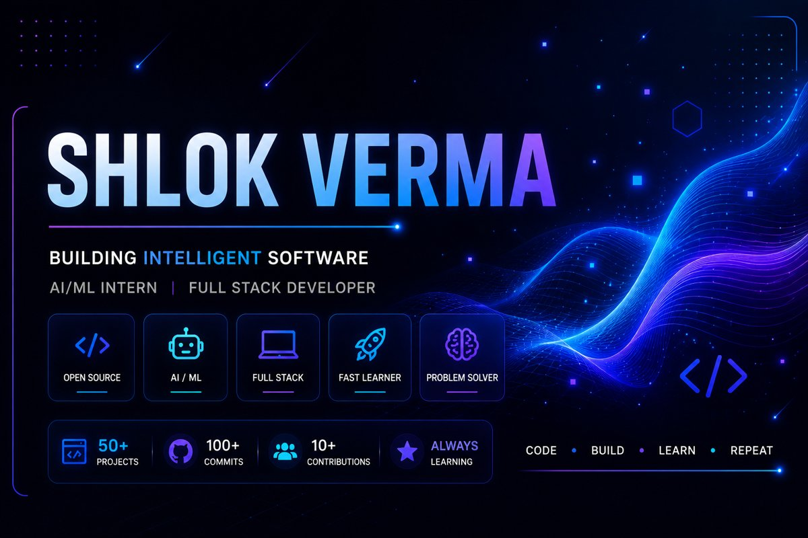

<div align="center">



<br/>

# Shlok Verma

**Full-Stack Developer · AI/ML Explorer · Open Source Contributor**

<p>


</p>

<p>
<a href="https://github.com/Shlokverma0"></a>
<a href="https://www.linkedin.com/in/shlok-verma-113713363"></a>
<a href="mailto:vshlok24@gmail.com"></a>
<a href="https://github.com/Shlokverma0"></a>
</p>

</div>

<br/>

## 🧭 About Me

I'm a final-year B.Tech CSE student building at the intersection of **full-stack engineering** and **applied AI** — from computer-vision systems that process live video, to LLM-powered tools that reason over documents and the web. I care about shipping things that actually work end-to-end, not just demos.

```yaml
role:         Full-Stack Developer · AI/ML Explorer
currently:    Contributing to open source via GirlScript Summer of Code (GSSoC)
deepening:    Machine Learning · System Design · Full-Stack Architecture
building:     Computer-vision applications · LLM/RAG systems
open_to:      Internships · Open Source Collaboration · Full-Stack/AI-ML Roles.
```

<br/>

## 🛠️ Tech Stack

<table>
<tr>
<td valign="top" width="50%">

**Languages**
<br/>


**Frontend**
<br/>


</td>
<td valign="top" width="50%">

**Backend & Databases**
<br/>


**AI / ML**
<br/>


</td>
</tr>
</table>

**Tools & Platforms**
<br/>


<br/>

## 📊 Skill Proficiency

| Domain | Level | Details |
|:--|:--:|:--|
| Full-Stack Web Development | ████████░░ Advanced | React, Flask, REST APIs, responsive UI design |
| LLMs & RAG Systems | ███████░░░ Advanced | LangChain, ChromaDB, Ollama, vector embeddings, hybrid retrieval |
| Computer Vision | ███████░░░ Advanced | OpenCV, MediaPipe, face_recognition, real-time video processing |
| Programming Languages | ████████░░ Advanced | C++, Python, JavaScript, TypeScript, Java |
| Database Design | ███████░░░ Intermediate | MongoDB, PostgreSQL, MySQL, SQLite |
| Open Source Collaboration | ███████░░░ Intermediate | Git workflows, PR reviews, issue resolution at GSSoC |
| DevOps & Tooling | ██████░░░░ Intermediate | Docker, Kubernetes, Git/GitHub |

<br/>

## 💼 Experience

<table>
<tr>
<td>

### Open Source Contributor — GirlScript Summer of Code (GSSoC)
**May 2026 – Present · Remote**

Contributing to India's largest open-source program (30,000+ participants), working across 5+ repositories under real maintainer review.

- Resolved **10+ bugs** and implemented new features across 5+ open-source repositories
- Collaborated with **15+ maintainers and contributors** via GitHub pull requests, issues, and code reviews
- Built hands-on experience with Git/GitHub workflows, agile collaboration, and production-level code standards


</td>
</tr>
</table>

<br/>

## 🚀 Featured Projects

<table>
<tr>
<td>

### 🧠 DocMind — RAG Chatbot with Live Web Search

A local-first AI chatbot that answers questions from personal documents using Retrieval-Augmented Generation, with a hybrid fallback to live web search and general LLM knowledge — designed to never leave a query unanswered.

| Attribute | Detail |
|:--|:--|
| **Stack** | Python, LangChain, ChromaDB, Ollama (Llama 3.2), Groq API, Streamlit |
| **Architecture** | 3-tier pipeline — document retrieval (RAG) → live web search → LLM knowledge fallback |
| **Retrieval** | Vector similarity search over chunked document embeddings |
| **Deployment** | Cloud-hosted on Streamlit Community Cloud with Groq API + HuggingFace embeddings |
| **Interface** | Streamlit chat UI with persistent history and source attribution |

Most RAG demos hallucinate or refuse to answer once a query falls outside the source documents. DocMind routes each query through the most relevant source — docs → web → model knowledge — so it always returns a grounded, useful answer.


**[Live Demo →](https://docmind-shlok.streamlit.app)** · **[Repository →](https://github.com/Shlokverma0/RAG-CHATBOT)**

</td>
</tr>
<tr>
<td>

### 📸 Face Attendance Recognition System

A real-time AI attendance system that replaces manual sign-in with face-based verification — from image capture to attendance record in under 3 seconds.

| Attribute | Detail |
|:--|:--|
| **Stack** | Python, Flask, OpenCV, face_recognition, SQLite3, HTML/CSS/JS |
| **Accuracy** | 95%+ recognition accuracy across 20+ users |
| **Performance** | Attendance logging cut to under 3 seconds per user |
| **API Layer** | 5 RESTful Flask endpoints for face-match scoring, JSON image handling, and CRUD operations |
| **Interface** | Browser-based live camera capture UI + real-time dashboard with delete support |

The pipeline handles the full loop — 5-image face capture, encoding generation, SQLite storage — so the recognition model isn't just a script but a usable end-to-end system with its own dashboard.


**[Repository →](https://github.com/Shlokverma0)**

</td>
</tr>
<tr>
<td>

### ✋ Hand Gesture Detection System

A real-time gesture recognition engine built for touchless, camera-driven control interfaces.

| Attribute | Detail |
|:--|:--|
| **Stack** | Python, OpenCV, MediaPipe |
| **Throughput** | 30+ FPS across 2 simultaneous hands |
| **Latency** | Under 50ms per detection, gesture classification for 5+ distinct gestures |
| **Precision** | Tracks 21 landmark points per hand (42 total data points/frame) at 90%+ accuracy |
| **Optimization** | Reduced detection lag by 40%, sustained across 100+ consecutive test frames |

The landmark-tracking pipeline was tuned specifically to hold frame rate under load — a common failure point in real-time CV demos — rather than only working in ideal conditions.


**[Repository →](https://github.com/Shlokverma0)**

</td>
</tr>
<tr>
<td>

### 💱 Currency Converter

A responsive, single-page currency converter with live exchange-rate data and no unnecessary UI friction.

| Attribute | Detail |
|:--|:--|
| **Stack** | HTML, CSS, JavaScript |
| **Feature** | Live multi-currency conversion, instant on input change (no convert button) |
| **UX** | Dynamic light/dark mode with persistent UI state |
| **Design Detail** | Country flag icons mapped to currency codes for intuitive selection |


**[Repository →](https://github.com/Shlokverma0)**

</td>
</tr>
</table>

<br/>

## 🎓 Education

| Institution | Degree | Duration | Score |
|:--|:--|:--:|:--:|
| Bharat Institute of Technology, AKTU | B.Tech, Computer Science | 2023 – 2027 | CGPA: 6.71 |
| BBSSM Inter College, Meerut | 12th Standard (PCM) | 2018 – 2021 | 65% (12th) · 79% (10th) |

<br/>

## 🏅 Certifications & Achievements

| Recognition | Details |
|:--|:--|
| AI Foundations | Foundational knowledge of AI, Machine Learning, neural networks & responsible AI practices |
| GSSoC Recognition | Recognized as an active open-source contributor by the GirlScript Foundation |
| GSSoC Contribution | 10+ bugs resolved, 5+ repositories contributed to |

<br/>

## 🌐 Languages


<br/>

## 📈 GitHub Analytics

<div align="center">


</div>

<br/>

## 🎯 Current Focus

```yaml
learning:
  - Advanced Machine Learning & Deep Learning concepts
  - System Design fundamentals
  - Cybersecurity practices
  - Retrieval-Augmented Generation (RAG) & LLM application design

building:
  - Computer-vision-powered full-stack applications
  - LLM-powered tools (RAG chatbots, hybrid retrieval systems)
  - Open-source contributions via GSSoC

open_to:
  - Full-Stack Development Internships (SDE / AI-ML)
  - Open Source Collaboration
  - Hackathon teams building applied-AI products
```

<br/>

<div align="center">

## 🤝 Let's Connect

<a href="https://www.linkedin.com/in/shlok-verma-113713363"></a>
<a href="https://github.com/Shlokverma0"></a>
<a href="mailto:vshlok24@gmail.com"></a>

<br/><br/>

*"Consistency beats intensity."*


