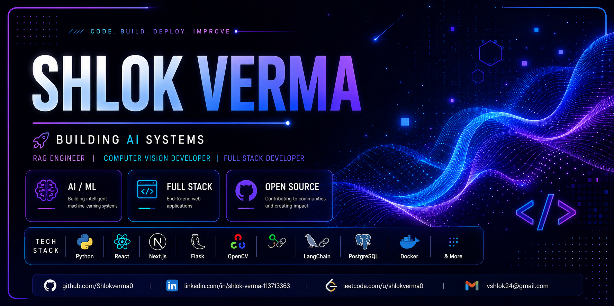

<div align="center">  <br/> <h3 align="center"> Building intelligent systems, one commit at a time 🚀 </h3> **Full-Stack Developer · AI/ML Engineer** <p> <a href="https://github.com/Shlokverma0"></a> <a href="https://www.linkedin.com/in/shlok-verma-113713363"></a> <a href="https://leetcode.com/u/shlokverma0/"></a> <a href="mailto:vshlok24@gmail.com"></a> </p> <p>   </p> </div> 
## 🧭 About Me

```text


Shlok Verma
├── Education
│   └── B.Tech Computer Science & Engineering
│
├── Experience
│   ├── Machine Learning Intern
│   └── Open Source Contributor (GSSoC)
│
├── Working With
│   ├── Machine Learning
│   ├── Computer Vision
│   ├── Retrieval-Augmented Generation
│   └── Full-Stack Development
│
├── Currently Exploring
│   ├── LLM Agents
│   ├── AI Infrastructure
│   ├── System Design
│   └── MLOps
│
└── Goal
    Build intelligent software that is reliable,
    scalable, and useful in real-world applications.
```


## 📡 Tech Radar

<table>
<tr>
<td valign="top" width="20%"><b>🟣 Expert</b><br/><br/>Python<br/>Git / GitHub</td>
<td valign="top" width="20%"><b>🔵 Advanced</b><br/><br/>React<br/>Flask<br/>OpenCV<br/>LangChain</td>
<td valign="top" width="20%"><b>🟢 Intermediate</b><br/><br/>Next.js<br/>PostgreSQL<br/>Docker</td>
<td valign="top" width="20%"><b>🟡 Learning</b><br/><br/>System Design<br/>Kubernetes<br/>Deep Learning</td>
<td valign="top" width="20%"><b>⚪ Exploring</b><br/><br/>LLM Agents<br/>Vector Databases</td>
</tr>
</table>


## ⚡ Engineering Stack

| Category | Stack |
|:--|:--|
| 🚀 **Programming Languages** |         |
| 🎨 **Frontend Engineering** |     |
| ⚙️ **Backend Engineering** |     |
| 🗄️ **Databases** |      |
| 🤖 **Artificial Intelligence** |      |
| 👁️ **Computer Vision** |     |
| 🔗 **RAG & LLM Engineering** |      |
| ☁️ **Cloud & DevOps** |     |
| 🧰 **Developer Tools** |      |
| 🖥️ **Operating Systems** |   |


## 💼 Experience

### 🏢 Machine Learning Intern — Vinnpro Technologies
`July 2026 – August 2026`

- Developed and tested machine-learning(ML) models.
- Worked on real-world datasets and model evaluation.
- Collaborated with mentors on deployment workflows.
- Improved model accuracy or performance.

---

### 🌱 Open Source Contributor — GSSoC
`May 2026 – Present`

- Resolved bugs and implemented new features.
- Collaborated with maintainers through pull requests.
- Followed industry-standard Git workflows.
- Contributed to multiple repositories.


## 🚀 Featured Projects
<table>
<tr>
<td width="50%" valign="top">

### 🧠 DocMind
**RAG Chatbot with Live Web Search**

Hybrid RAG chatbot with a 3-tier fallback — documents, live web search, then LLM knowledge — so every query gets a grounded answer.

   

📊 3-tier retrieval pipeline · Cloud-hosted on Streamlit

**[Live Demo](https://docmind-shlok.streamlit.app)** · **[Repository](https://github.com/Shlokverma0/RAG-CHATBOT)**

</td>
<td width="50%" valign="top">

### 🛡️ SecureVision Pro
**Enterprise AI Surveillance & Attendance Platform**

Unified surveillance system fusing liveness-verified attendance, dual-class fire/smoke detection, and after-hours intrusion monitoring into one real-time event pipeline — built to feel like a production security product, not a single-purpose demo.

    

📊 Unified multi-module event feed · Real-time Email/SMS/WhatsApp alerting

**[Live Demo](YOUR_LIVE_DEMO_LINK)** · **[Repository](https://github.com/Shlokverma0/securevision-pro)**

</td>
</tr>
<tr>
<td width="50%" valign="top">

### ✋ Hand Gesture Detection
**Real-Time Landmark Tracking Engine**

Touchless gesture recognition tuned to hold frame rate under sustained load, not just ideal conditions.

  

📊 30+ FPS · <50ms latency · 90%+ accuracy

**[Repository](https://github.com/Shlokverma0)**

</td>
<td width="50%" valign="top">

### 💱 Currency Converter
**Zero-Friction Live Conversion**

Single-page converter with instant live-rate conversion on input and persistent theme state.

  

📊 No convert button · Persistent dark/light mode.

**[Live Demo](https://stately-kelpie-cc0aed.netlify.app/)** · **[Repository](https://github.com/Shlokverma0)**

</td>
</tr>
</table>


### 📊 GitHub Analytics

<div align="center">


<br><br>


</div>

## 🐍 Open Source Journey

<div align="center">


<br><br>


<br><br>

</div>
---

### 🌱 Open Source Highlights

- 🔀 Contributed to multiple repositories through GSSoC.
- 🚀 Built AI, RAG, and computer-vision applications.
- 👥 Collaborated with maintainers through pull requests and issue reviews.
- ⚡ Continuously improving system design and full-stack engineering skills.


## 🎯 Current Focus

| Learning | Building | Open To |
|:--|:--|:--|
| Advanced ML & Deep Learning | CV-powered full-stack apps | Full-Stack / AI-ML roles |
| System Design fundamentals | LLM-powered retrieval tools | Open source collaboration |
| Cybersecurity practices | GSSoC contributions | Hackathon teams |


## 🏅 Certifications

| Certification | Focus Area |
|:--|:--|
| AI Foundations | Machine Learning, Neural Networks, Responsible AI |
| Open-Source Experience — GSSoC | Collaborative Engineering, Code Review, Git Workflows |
| Machine Learning Internship — Vinnpro Technologies | Applied ML, Model Evaluation, Deployment |


<div align="center">

## 📬 Contact

<table>
<tr>
<td align="center" width="25%">
<a href="https://github.com/Shlokverma0"></a>
<br/>Code & Projects
</td>
<td align="center" width="25%">
<a href="https://www.linkedin.com/in/shlok-verma-113713363"></a>
<br/>Professional Network
</td>
<td align="center" width="25%">
<a href="https://leetcode.com/u/shlokverma0/"></a>
<br/>Problem Solving
</td>
<td align="center" width="25%">
<a href="mailto:vshlok24@gmail.com"></a>
<br/>Direct Contact
</td>
</tr>
</table>

<br/>

*"Consistency beats intensity."*


</div>
